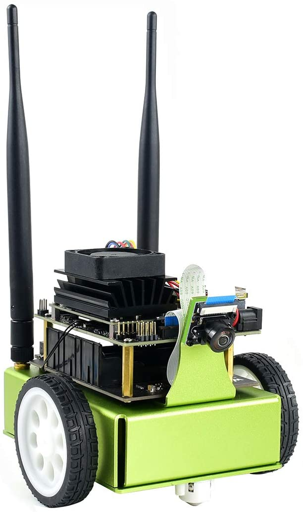

# JetBot - Waveshare

> Looking for a quick way to get started with JetBot?  Many third party kits are [now available](https://jetbot.org/master/third_party_kits.html)!

JetBot is an open-source robot based on NVIDIA Jetson Nano that is

* **Affordable** - Less than $150 add-on to Jetson Nano
* **Educational** - Tutorials from basic motion to AI based collision avoidance
* **Fun!** - Interactively programmed from your web browser

Building and using JetBot gives the hands on experience needed to create entirely new AI projects.

To get started, read the [JetBot documentation](https://jetbot.org).

---

## Reference

- [Waveshare kit](https://www.waveshare.com/catalog/product/view/id/3755)
- [JetBot Org](https://jetbot.org/master/third_party_kits.html)
- [JetBot Wiki](https://www.waveshare.com/wiki/JetBot_AI_Kit)